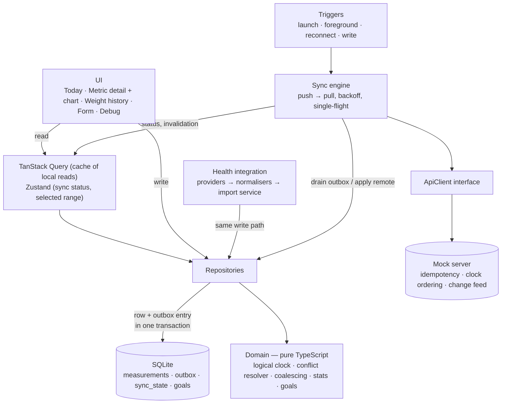

# Health Progress Tracker

A React Native app for tracking weight, steps, sleep, water and workouts. It is offline-first: every change is saved to a local database first and synchronised with a mocked backend whenever a connection is available.

The assignment values engineering decisions over feature count, so I put the time-box into one vertical slice and made it solid:

> **manual entry → local database → outbox → sync → conflict resolution → dashboard and charts**

Weight goes through that whole path (add, edit, delete, history). Water can be logged by the glass. Steps, sleep and workout arrive through the health-integration layer.

I built this with an AI coding agent. What it did, what I decided, and what was verified by whom is in [AI usage](#ai-usage) and, in full, in [docs/AI_USAGE.md](docs/AI_USAGE.md).

## Contents

1. [Setup](#setup)
2. [Scope: what is and is not built](#scope-what-is-and-is-not-built)
3. [Architecture overview](#architecture-overview)
4. [Key technical decisions](#key-technical-decisions)
5. [State-management approach](#state-management-approach)
6. [Local persistence approach](#local-persistence-approach)
7. [Health / device integration approach](#health--device-integration-approach)
8. [Offline and synchronisation strategy](#offline-and-synchronisation-strategy)
9. [Conflict-resolution approach](#conflict-resolution-approach)
10. [Application lifecycle](#application-lifecycle)
11. [Performance considerations](#performance-considerations)
12. [Loading, error and empty states](#loading-error-and-empty-states)
13. [Testing strategy](#testing-strategy)
14. [Trade-offs](#trade-offs)
15. [Known limitations](#known-limitations)
16. [What I would improve with more time](#what-i-would-improve-with-more-time)
17. [Assumptions](#assumptions)
18. [AI usage](#ai-usage)

---

## Setup

Requirements: Node ≥ 22.11 (`.nvmrc` pins 22.20), Xcode + CocoaPods for iOS, Android SDK + JDK 17 for Android. See the React Native [environment setup](https://reactnative.dev/docs/set-up-your-environment).

```bash
nvm use                       # Node 22
npm install

# iOS
bundle install
cd ios && bundle exec pod install && cd ..
npm run ios

# Android (emulator running or device attached)
npm run android

# Metro, if it is not started for you
npm start -- --reset-cache
```

- If a Metro bundler from an earlier checkout is already running, restart it with `--reset-cache`; otherwise the `@/` import alias will not resolve.
- If an Android emulator is short on storage, `npx react-native run-android --active-arch-only` installs a much smaller build.

Checks:

```bash
npm test            # Jest, 233 tests
npm run typecheck   # tsc --noEmit, strict
npm run lint        # ESLint
```

There is no backend to run. The mock server lives inside the app.

### A two-minute tour

1. **Today** tab: the app starts clean, every card at zero. Go to **Debug** → *Import dummy data*; back on Today the cards show today's values.
2. Tap a card to see its chart and summary for 7 days, 30 days or 3 months. Touch the chart to read a value.
3. **Today** → *Add weight*. Then Weight card → *All measurements*: the new row has a *Waiting to sync* badge, then turns *Synced*. Tap a row to edit or delete it.
4. **Today** → *Add a glass of water*, or − / + on the Water screen.
5. **Debug** → turn on *Simulate offline*. Add, edit and delete weights. The banner says the changes are saved on the device. Kill and reopen the app: they are still there, still pending. Turn offline off: they sync.
6. **Debug** → set *Failure rate* to 100%, add a weight, watch the outbox show attempts and the next retry time; set it back to 0% and tap *Sync now*.
7. **Debug** → *Edit from another device* changes your newest weight on the server with a newer timestamp; after the sync your device shows the other device's value.
8. **Debug** → *Seed 3 years of data*, then open Weight → *All measurements* and scroll, and switch ranges on the metric screens.

---

## Scope: what is and is not built

### Implemented

| Area | What exists |
|---|---|
| Dashboard | A "Today" grid: one card per metric (weight, steps, sleep, water, workout) with today's value and goal progress. Every card is zero until something is recorded today |
| Historical progress | Per-metric screen with a chart, goal, and summary (latest, average, lowest, highest, change) for 7 days / 30 days / 3 months |
| Manual data: weight | Add, edit, delete, paginated history |
| Manual data: water | Add or take back a glass, from the dashboard or the water screen |
| Health integration | A provider interface, three mocked providers that report the same readings in different shapes and units, a normaliser per provider, idempotent import |
| Offline-first | SQLite as the source of truth, a durable outbox written in the same transaction as each change, retry with exponential backoff |
| Synchronisation | Push and pull, idempotency keys, ordering by hybrid logical clock, tombstones, coalescing of queued operations |
| Conflict resolution | Last-write-wins per record by logical clock, plus a separate display rule for manual vs. device readings |
| Lifecycle | Crash recovery of in-flight operations; sync on launch, on return to foreground and on reconnect |
| Mock API | Latency, failures before and after the server acted, duplicate delivery, reordering — all switchable at runtime |
| States | Loading, empty, error, partial data, offline, pending, failed sync, provider unavailable, permission denied |
| Performance | Aggregation in SQL, keyset pagination, tuned list, a 3-year seed to try it |
| Tests | 233 tests across 23 suites |
| Debug screen | Network controls, outbox viewer, dummy-data import, remote-edit simulation, seed |

### Partially implemented

| Area | What is there | What is missing |
|---|---|---|
| Health import UX | The integration layer is complete and tested | No user-facing "connect a source" screen. Import is a button on the Debug screen, always for the last 30 days. Provider-unavailable and permission-denied show only in that button's result text |
| Changes the server rejects | Surfaced in the banner and on the row; can be retried | No "discard and revert" action |
| Multiple devices | The protocol supports it and is tested; the Debug screen can inject an edit "from another device" | No login, and the in-app mock server cannot be reached by a second phone |
| Goals | Stored, seeded with defaults, shown on cards and charts | No screen to edit them |
| Manual entry | Weight and water | Steps, sleep and workout are import-only |
| Performance verification | Seeded with 3 years of data and tried by hand on an Android emulator | Not profiled |
| iOS | Builds, launches, opens the database, renders | The flows were exercised on Android only |

### Designed but not implemented

- **Background sync while the app is closed** — `react-native-background-fetch` calling `SyncEngine.run()`. The engine keeps no state in memory that matters, so it needs no changes.
- **Authentication and one database file per user**, wiped on sign-out.
- **A real HealthKit / Health Connect adapter** — one class implementing `HealthProvider`, registered in one file.
- **Server-assigned ordering** in production, with the logical clock kept for client-side ordering (see [Conflict resolution](#conflict-resolution-approach)).
- **A materialised daily-aggregates table** for multi-year ranges.
- **Database encryption** (SQLCipher).

### What I would implement next

In order: discard for rejected changes → a source-connection screen and a real Health Connect adapter → background sync → authentication with a per-user database → end-to-end tests of the offline → kill → relaunch → sync path.

---

## Architecture overview



The detailed component diagram and two sequence diagrams (an offline write that later syncs; a lost response or a crash mid-request) are in [docs/architecture.md](docs/architecture.md).

```
src/
  app/            composition root (bootstrap.ts), navigation, providers
  domain/         pure TypeScript, no React / React Native / SQLite imports
  data/           SqlDriver, schema + migrations, repositories, mappers
  sync/           SyncEngine, triggers
  api/            ApiClient interface, wire types + guards, mock server/client
  integrations/   health provider interface, normalisers, mock providers
  features/       dashboard (cards, charts), measurements, settings (debug)
  shared/         components, services (Clock, IdGenerator, NetworkMonitor), state, theme
  test/           in-memory database, fakes
```

Four rules hold the design together:

1. **SQLite is the single source of truth.** Screens read the database, never the network. Sync is a background concern that changes the database and invalidates queries.
2. **A local write is one transaction** containing the row *and* its outbox entry. If the app dies at any instant, either both exist or neither does.
3. **The domain layer is pure.** Ordering, conflict resolution, coalescing, backoff, goal and summary maths have no I/O, which is why most of the tests are fast unit tests.
4. **Everything external is behind an interface** — `ApiClient`, `HealthProvider`, `SqlDriver`, `Clock`, `IdGenerator`, `NetworkMonitor` — and wired in one file, [src/app/bootstrap.ts](src/app/bootstrap.ts). Replacing the mock backend or a mock provider with a real one touches that file (or [registry.ts](src/integrations/health/registry.ts)) and nothing else.

---

## Key technical decisions

| Concern | Choice | Why | Considered and rejected |
|---|---|---|---|
| Framework | React Native CLI 0.87, New Architecture, TypeScript strict | Direct control of the native projects | Expo — quicker to start, not wanted here |
| Local database | SQLite via `@op-engineering/op-sqlite`, hand-written SQL behind a small `SqlDriver` interface | Real transactions (row + outbox atomically), indexes, aggregation in SQL | AsyncStorage / MMKV — no transactions or queries. WatermelonDB / Realm — bring their own sync model, which would hide the logic this assignment is about. Drizzle — see below |
| Reading data | TanStack Query over repositories | Loading / error states, caching, explicit invalidation, infinite queries | Redux — boilerplate for what is a cache of local reads |
| UI state | Zustand | Selector subscriptions, tiny | Context — re-renders every consumer |
| Lists | `FlatList`, tuned | The list is paginated; loaded rows stay in the hundreds | FlashList — worth it for much longer lists |
| Forms | `useState` + a pure validator | One small form; the validator is unit-tested on its own | react-hook-form + zod — more than this needs |
| Validation at boundaries | Hand-written type guards | Provider payloads and API responses are untrusted and checked before they reach the database | zod |
| IDs | `uuid` v4 (+ `react-native-get-random-values`) | Client-generated ids make offline creates and idempotent retries possible | Server-assigned ids |
| Ordering | Hybrid logical clock | Device clocks are wrong or get changed; arrival order is meaningless offline | Wall-clock timestamps, server arrival order |
| Mock backend | In-app `MockServer` behind `ApiClient` | Deterministic in tests, controllable from the Debug screen | MSW — needs polyfills in React Native for little gain |
| Navigation | React Navigation (native stack + bottom tabs) | Native transitions, typed params | — |
| Charts | A small `TrendChart` on `react-native-svg`, with the layout maths in a pure, tested module | At most 30 points per range; one native dependency; full control of marks and touch | victory-native — Skia + Reanimated, three native dependencies for two chart types. gifted-charts — less control over marks |

### Decisions that changed during implementation

- **Drizzle was dropped after a spike.** The plan was Drizzle over op-sqlite. Its op-sqlite driver issues `BEGIN`, calls the transaction callback, and issues `COMMIT` without awaiting the callback's promise, so an async transaction is not atomic — which breaks rule 2 above. It was replaced by a ~60-line [`SqlDriver`](src/data/db/SqlDriver.ts) with explicit `BEGIN IMMEDIATE` / `COMMIT` / `ROLLBACK`, a queue so unrelated queries cannot slip inside an open transaction, and tests for exactly those properties. Migrations are an ordered list tracked with `PRAGMA user_version`.
- **The test database is `better-sqlite3`**, not libsql: libsql's in-memory client does not keep a manual transaction on one connection. Repository and sync tests therefore run real SQL (window functions, upserts, partial unique indexes) in Node.
- **The `@/` import alias is resolved by Metro** (`resolveRequest` in `metro.config.js`), mirrored in `tsconfig.json` and `jest.config.js`. The Babel plugin approach did not resolve under Metro in this setup.
- **Charts moved from "deferred" to built**, as a small SVG component rather than a charting library.

---

## State-management approach

Each kind of state has exactly one owner:

| State | Owner | Notes |
|---|---|---|
| Health data, goals, outbox | SQLite | The only durable copy |
| What the screens show | TanStack Query | A cache of database reads. `staleTime: Infinity`, `networkMode: 'always'`; invalidated explicitly after a local write and after a sync run that changed something |
| Sync status, selected range | Zustand | Sync status is pushed by the engine; components select the fields they use |
| Form input | `useState` in the form | Typing re-renders the form only |

There is no global store of measurements. Keeping a second copy in memory is where offline apps usually drift out of step with their database.

---

## Local persistence approach

Schema ([src/data/db/schema.ts](src/data/db/schema.ts)):

- `measurements` — `id`, `user_id`, `metric`, `value` (canonical unit), `measured_at`, `source` (`manual` or `provider:<id>`), `external_id`, `hlc`, `deleted_at` (tombstone), `sync_status`.
- `outbox` — `op_id` (also the idempotency key), `entity_id`, `op_type`, `payload` (full record snapshot), `hlc`, `status` (`pending` / `in_flight` / `failed`), `attempts`, `next_attempt_at`, `last_error`.
- `sync_state` — pull cursor, device id, last sync time, last import per provider.
- `goals`.

Indexes: `(user_id, metric, measured_at DESC, id DESC)` serves history paging, range scans and the dashboard's "today" query; a partial unique index on `(source, external_id)` makes a provider record importable only once.

Deletes are soft: a tombstone has to travel to the server and to other devices like any other change.

Migrations run in a transaction each and are tracked with `PRAGMA user_version`. There are two: the initial schema, and a clean-up for a metric that was removed during development.

---

## Health / device integration approach

```
HealthProvider (FitBand / Pulse Health / ScaleCo — mocked)
        ↓  raw records, provider-specific
Normaliser (one per provider, hand-written guards)
        ↓  NormalizedReading { metric, value, measuredAt, externalId }
HealthImportService
        ↓  MeasurementRepository.upsertImported()  ← same write path as manual entries
Application
```

The three mock providers describe the same underlying readings differently, as the brief suggests:

| Provider | Weight | Sleep | Water | Timestamp |
|---|---|---|---|---|
| FitBand | `{ type: "weight_kg", value: 72.57 }` | minutes | millilitres | ISO-8601 string |
| Pulse Health | `{ dataType: "weight", quantity: 160, unit: "lb" }` | hours | fluid ounces | epoch seconds |
| ScaleCo | `{ body_weight: 72570 }` (grams) | seconds | — | epoch milliseconds |

A test asserts all three normalise to the identical canonical reading.

- **The app cannot tell mock from real.** Only [registry.ts](src/integrations/health/registry.ts) constructs providers. A real adapter implements the same [`HealthProvider`](src/integrations/health/HealthProvider.ts) interface (`isAvailable`, `requestPermission`, `read`).
- **Imports are idempotent.** The record id is derived from `source` + the provider's own id, so importing twice — or on two devices — converges on one record.
- **Bad data is contained.** A malformed record is counted and skipped, not fatal. A unit the app cannot convert (the mock sends one weight in stone) is rejected rather than guessed.
- **A deleted import stays deleted.** Re-importing does not resurrect a reading the user removed.
- **Imported readings sync** like manual ones, because they use the same repository.
- **Failure states are simulated:** ScaleCo is "not installed" until switched on in the Debug screen (provider unavailable); Pulse Health declines permission on the first attempt and grants it on the second.

In this build the import is triggered from the Debug screen (*Import dummy data*) rather than from a user-facing screen. That is a UI decision; the integration layer underneath is the part the brief asks about and is unchanged by it.

---

## Offline and synchronisation strategy

**Write path.** `repository.create / update / remove / adjustDailyTotal` → one transaction: write the row with a new logical-clock value and `sync_status = 'pending'`, append an outbox op → invalidate queries → nudge the sync engine (debounced). The UI never waits for the network.

**Sync engine** ([src/sync/SyncEngine.ts](src/sync/SyncEngine.ts)): push, then pull, never concurrently with itself.

*Push*
1. Read pending ops, oldest first, and **coalesce** per record: create + update → one create; update + delete → one delete; create + delete → nothing is sent.
2. Mark the ops `in_flight` and increment `attempts` **before** the request leaves.
3. Send a batch (50 records). Each op carries its own idempotency key and gets its own result:
   - `applied` → remove the ops, mark the row synced (only if it still has the version that was sent);
   - `stale` → the server holds a newer version; remove the ops and apply the server's version;
   - `rejected` → park the op as `failed`, mark the row, show it to the user.
4. A retryable failure (timeout, dropped connection) returns the ops to `pending` with `next_attempt_at = now + backoff`. Backoff is exponential (2 s base, 5 min cap) with jitter. A timer runs the next attempt.
5. Loop until nothing is due, so edits made while a batch was in flight go out in the same run.

*Pull*
- Fetch changes after the stored cursor, page by page. Each page **and its cursor** are committed in one transaction, so an interrupted pull resumes exactly where it stopped.

**Triggers:** app start, return to foreground, connectivity restored, after a local write (debounced), pull-to-refresh, the backoff timer. Foreground and reconnect ignore backoff — the conditions that caused the failure have probably changed.

How each concern from the brief is handled:

| Concern | Mechanism |
|---|---|
| Local persistence | SQLite; the UI reads only from it |
| Pending changes | Durable `outbox` table, written in the same transaction as the change |
| Retry | Exponential backoff with jitter per op; forced on reconnect / foreground / manual |
| Failed synchronisation | Retryable → backoff and banner; terminal → parked as `failed` with the server's reason and a *Retry* action |
| Duplicate requests | `op_id` idempotency key; the server returns the original result for a replay |
| Requests out of order | The server and the client compare logical clocks, never arrival order; an older write is a no-op |
| App terminated before sync completes | The outbox survives. On launch `in_flight` → `pending`, then replay; replays are safe because of the idempotency key |

One detail worth calling out: *create + delete → send nothing* is only correct if the create never left the device. If its `attempts` is above zero it may have reached the server before a crash, so the delete **is** sent in that case. There is a test for it.

---

## Conflict-resolution approach

Two separate questions, deliberately handled by two separate mechanisms.

### 1. Two versions of the same record — last write wins, by hybrid logical clock

Every write stamps the record with a hybrid logical clock (HLC): `(physical ms, counter, device id)`, serialised so that plain string comparison orders it ([hlc.ts](src/domain/sync/hlc.ts)). When two versions of one record meet — on the server during a push, or on the device during a pull — the higher HLC wins and the other is discarded ([conflictResolver.ts](src/domain/sync/conflictResolver.ts)). The same function runs on both sides, so they converge.

- **Ordering** does not depend on arrival order or on the wall clock alone. If the device clock jumps backwards the counter keeps timestamps increasing; seeing a remote timestamp from the future advances the local clock past it.
- **Concurrent updates** from two devices in the same millisecond are ordered by device id, so every device picks the same winner.
- **Duplicates** have equal HLCs and are ignored.
- **Deletes** are tombstones with an HLC. A later delete beats an earlier edit; an earlier edit can never resurrect a later delete.
- **Idempotency** follows: applying the same change twice, or an old change late, changes nothing.

### 2. Two *different* records for the same day — a display rule

A manual entry and a device reading are different records with different ids. They do not conflict and both are kept. Which one is shown for a day is a domain rule ([effectiveValue.ts](src/domain/measurement/effectiveValue.ts)):

> A manual reading beats a device reading; among the same kind the most recently measured wins; an exact tie is broken by HLC.

The reasoning: typing a number is a deliberate statement by the user, a sensor reading is passive. The rule applies to weight and to water.

### The scenario from the brief

```
10:01  User records 72.8 kg      → record A (manual),  hlc h1
10:02  Device reports 72.5 kg    → record B (device),  hlc h2   different record, no conflict
10:03  User edits to 72.6 kg     → record A,           hlc h3   same record, h3 > h1 → 72.6
10:04  Offline changes sync      → A's create+update coalesce into one request carrying 72.6
```

**Displayed: 72.6 kg.** 72.5 kg stays in the history, labelled with its source. This scenario is a named test in [effectiveValue.test.ts](src/domain/measurement/effectiveValue.test.ts), and the same rule is implemented in SQL for the chart series and tested there too.

Because the two layers are separate, changing the display rule (say, "most recent wins regardless of source") is a one-function change that does not touch sync.

### How I would approach this in production

- The server would assign the authoritative order (a per-user sequence) and reject on a version check; the HLC would remain for client-side ordering and tie-breaking.
- Last-write-wins is right for a single scalar like a weight. For records with several independently edited fields I would merge per field, and for anything where silent loss is unacceptable I would surface the conflict to the user instead.
- Idempotency keys would expire server-side after a retention window; tombstones would be compacted once every device has passed them.
- A user-visible audit trail ("changed on your other phone") is cheap once every version carries a device id.

---

## Application lifecycle

| Scenario | Handling | Status |
|---|---|---|
| App goes to the background during a sync | The in-flight request is allowed to finish. If the OS suspends the app first, the op stays `in_flight` and is recovered on the next launch or foreground | Implemented |
| App terminated with operations pending | The outbox is on disk. `bootstrap` resets `in_flight` → `pending` and syncs. The logical clock is restored from the highest stored HLC | Implemented, tested, checked on a device |
| Network lost during an operation | A retryable error; backoff, and an immediate attempt when NetInfo reports the connection is back | Implemented, tested |
| App reopened after several hours | Returning to the foreground triggers a forced sync; timers do not fire while suspended, so this is the trigger that matters | Implemented, tested |
| User logs in from another device | The other device pulls from cursor zero and receives every record and tombstone; concurrent edits resolve by HLC. Needs authentication and a per-user database file, which are not built. The Debug screen's *Edit from another device* demonstrates the merge | Protocol implemented and tested; login not implemented |
| Sync while the app is closed | `react-native-background-fetch` (BGTaskScheduler / WorkManager) calling `SyncEngine.run()` | Designed |

---

## Performance considerations

Designed for several years of data per user.

- **Aggregation happens in SQL.** A chart range is one query that reduces each day to a single value and groups days into buckets (daily for 7 d / 30 d, weekly for 3 m). JS receives at most 30 rows whether the table holds a hundred readings or a hundred thousand. No arrays of raw readings are mapped or reduced on the JS thread.
- **Charts draw at most 30 marks**, so plain SVG is enough and there is nothing to down-sample.
- **Keyset pagination** for history (`WHERE (measured_at, id) < cursor ORDER BY … LIMIT 30`), not `OFFSET`: the cost of a page does not grow with scroll depth, and rows inserted mid-scroll cannot shift or duplicate items. Only loaded pages are in memory.
- **One composite index** matches the hot queries.
- **FlatList tuning:** fixed row height with `getItemLayout`, memoised rows, stable `keyExtractor` / `renderItem` / `onPress`, explicit `windowSize` and batch sizes, `removeClippedSubviews`.
- **Re-renders:** Zustand selectors; memoised dashboard cards; chart geometry memoised on its inputs; form state is local.
- **The dashboard is one indexed query** for today's rows across all metrics.
- **Sync** sends 50 records per request and reads the outbox in bounded pages, so a large backlog does not block a frame or balloon memory.

The Debug screen's *Seed 3 years of data* inserts 3,285 readings. On an Android emulator the insert took about 0.7 s, after which history scrolling (paging back through several months) and range switching stayed responsive. This was checked by hand, not profiled.

**Scaling further:** a materialised `daily_aggregates` table maintained on write, so range queries stop touching raw rows; LTTB down-sampling if a chart ever plots raw multi-year data; FlashList if a list must hold thousands of loaded rows.

---

## Loading, error and empty states

| State | Where | What the user sees |
|---|---|---|
| Initial loading | App start; metric screen; history | "Opening your data…", then skeleton blocks / a labelled spinner. The dashboard shows its zero cards immediately rather than a spinner |
| Database could not open | App start | Error with the reason and *Try again* |
| No health data | Dashboard | Every card reads zero, with "Nothing recorded today…" and the *Add weight* and *Add a glass of water* buttons |
| No historical data in the range | Metric screen | "No data in the last 7 days. The reading above is the most recent one." No empty chart is drawn |
| One value in the range | Chart | The point is drawn, with "Only one value in this range so far." |
| Partial data | Dashboard | Metrics with data show their value; the rest stay at zero. An import where some providers fail still stores the rest and names the ones that failed |
| Offline | Banner on every screen | "Offline. 2 changes saved on this device will sync when you reconnect." |
| Changes pending | Banner + per-row badge | "2 changes waiting to sync." · *Sync now* |
| API failure / failed sync | Banner | "Sync failed: Request timed out. 2 changes waiting. Retrying at 10:04:32." · *Sync now* |
| Change rejected by the server | Banner + row badge | "1 change could not be synced." · *Retry*; the reason is in the Debug outbox |
| Provider unavailable | Debug → *Import dummy data* | "ScaleCo: not available" until *ScaleCo app installed* is switched on |
| Permission denied | Debug → *Import dummy data* | "Pulse Health: access not granted" on the first attempt; a second attempt is granted |
| Invalid form input | Form | A message under the field that is wrong |
| Record deleted elsewhere | Edit form | "This measurement no longer exists" |
| Unexpected crash | Any screen | Error boundary with *Try again*; "Your saved data is safe on this device." |

The banner's wording is decided by a pure function with a test per state ([SyncBanner.tsx](src/shared/components/SyncBanner.tsx)).

---

## Testing strategy

233 tests in 23 suites, run with `npm test` in about two seconds. Effort went where a bug would silently lose or corrupt data.

| Area | What is covered |
|---|---|
| Conflict resolution | Newer wins, stale ignored, duplicates ignored, deterministic tie-break, delete vs. edit in both orders |
| Hybrid logical clock | Monotonic when the wall clock goes backwards, distinct within a millisecond, advances past remote timestamps |
| Outbox coalescing | Every combination, including "the create may already have landed" |
| Backoff | Growth, cap, jitter bounds |
| SQL driver | Commit, rollback, isolation of unrelated queries from an open transaction, migrations |
| Repositories (real SQLite) | Row + outbox atomicity (and neither on failure), keyset pagination stability, series bucketing and time zones, today's values, import idempotency |
| Mock server | Idempotent replay, stale write rejected, change feed and cursor, persistence |
| **Sync engine** | Happy path, coalescing, batching, offline, retry and backoff, timer-driven retry, server rejection, lost-response replay, crash recovery, stale push, edit during an in-flight push, pull paging, concurrent triggers |
| Normalisers | Three providers → identical output; malformed and unknown-unit records rejected |
| Import service | Idempotency, unavailable, permission denied, partial failure |
| Calculations | Effective value (including the 10:01–10:04 scenario), goals, summaries, formatting, form validation |
| Charts | Round-numbered axes, zero baseline for columns, capped column width, gaps for missing days, goal kept in range, single point, touch selection |
| Water | Adding and removing glasses, continuing from an imported total, floor at zero, daily cap, one record per day |
| Components | Form shows field errors and saves locally without calling the network; dashboard zero state, values after an import, manual-over-device, daily reset, offline banner |

Tests use the real implementations wherever possible: an in-memory SQLite database behind the same `SqlDriver`, and a fake API client backed by the real `MockServer`. Only time, ids and connectivity are faked.

Not covered: end-to-end tests on a device (Detox / Maestro), and the native module boundary (op-sqlite itself).

---

## Trade-offs

- **Depth over breadth.** One metric has full CRUD and one has quick-add; the others are import-only. In exchange the sync path is tested for the failure modes that matter.
- **Hand-written SQL instead of an ORM.** More verbose and not type-checked against the schema; in exchange the transaction behaviour is explicit and tested, and there is one less dependency.
- **`sync_status` is stored on the row** rather than derived from the outbox. Cheaper to read in a list, at the cost of keeping two things consistent; they are always written in the same transaction.
- **Whole-record last-write-wins.** Simple and predictable; it discards the losing edit without telling the user.
- **Daily totals from providers (steps, sleep, workout) take the largest daily value across sources** instead of summing, to avoid double-counting when two providers track the same activity. Correct for daily totals, wrong for providers that report increments.
- **A manual water total beats a provider's**, like weight. Adding a glass continues from the value on screen and stores it as the day's manual record, so once the user logs by hand a later provider total for that day is ignored.
- **One manual water record per day**, with an id derived from the date, instead of a row per glass. Simple and it converges across devices, but two devices adding glasses offline resolve by last-write-wins rather than adding up.
- **The dashboard shows today only**, weight included. Consistent and simple; a weight recorded yesterday is one tap away rather than on the first screen.
- **A hand-rolled SVG chart instead of a library.** Small and fully controlled; no animation, zoom or panning.
- **Import lives on the Debug screen.** Keeps the main UI minimal, at the cost of no user-facing flow for connecting a source.
- **Day boundaries use the device's current UTC offset** for the whole window, so a day containing a daylight-saving change is cut an hour off.
- **The mock server runs in-process.** It shares the client's clock and cannot be reached by a second real device; multi-device behaviour is exercised through tests and the Debug screen rather than two phones.
- **Imported weights are not editable**, only deletable; the provider owns them.

---

## Known limitations

- No authentication; a single hard-coded user.
- No user-facing screen for connecting health sources; no real provider.
- Goals cannot be edited in the UI.
- A change the server rejected can be retried but not discarded from the UI.
- No background sync while the app is closed.
- Charts have no zoom or panning; ranges are fixed at 7 days, 30 days and 3 months.
- Light theme only; no localisation; weight in kilograms only; a glass is fixed at 250 ml.
- Seeded data covers weight, steps and sleep only, is inserted as already synced, and is not sent to the mock server. It exists to test performance.
- The mock server's idempotency table grows without bound.
- The tab bar uses text glyphs instead of an icon set.
- The flows were exercised on Android; iOS was checked to build, launch and render.
- One dashboard test intermittently logs a React `act()` warning when the whole suite runs in parallel. It does not fail.
- `npm audit` reports advisories in transitive development dependencies of the React Native toolchain; they were not triaged.

---

## What I would improve with more time

1. Discard-and-revert for rejected changes, with the server's reason shown inline on the row.
2. A user-facing source-connection screen and a real Health Connect / HealthKit adapter, with incremental import using the provider's change token instead of a fixed 30-day window.
3. Background sync.
4. Authentication, a database file per user, and wiping on sign-out.
5. End-to-end tests for the offline → kill → relaunch → sync path on both platforms.
6. Goal editing, and manual entry for the remaining metrics.
7. A `daily_aggregates` table for multi-year ranges.
8. Database encryption (SQLCipher) — health data is sensitive.
9. Error reporting and sync metrics (queue depth, retry counts, time-to-sync).
10. Dark mode, an accessibility audit, unit preferences.

---

## Assumptions

- One user, no login.
- Canonical units: kilograms, step count, minutes (sleep, workout), millilitres.
- Water is stored in millilitres and shown as whole glasses of 250 ml, so providers can keep reporting volumes.
- The dashboard shows today only: every card is zero until something is recorded today. Earlier readings are on the metric's screen.
- Several readings per day are allowed; one is chosen for display.
- Providers report steps, sleep, water and workout as daily totals.
- Device clocks may be wrong; correctness must not depend on them.
- The server is the meeting point for devices, not the authority on the truth: it applies the same last-write-wins rule as the client.
- Mocked providers and a mocked backend are acceptable, as the brief states.

---

## AI usage

I built this with **Claude Code** (Anthropic's coding agent) working in the repository. The short version is below; the full account, including the sequence of instructions I gave and what was verified by whom, is in **[docs/AI_USAGE.md](docs/AI_USAGE.md)**.

**Where it was used and for what.** Throughout. From the assignment brief it drafted the implementation plan and task list; it then wrote the source code, the tests, the diagrams and the first draft of this README, and ran type-check, lint, tests and device builds as it went. I directed the work: I set the stack constraints up front, reviewed the plan before any code was written, ran the app on an Android emulator between iterations, and changed the product several times based on what I saw.

**Significant suggestions from the AI that I kept**

- SQLite as the single source of truth with a transactional outbox.
- A hybrid logical clock for ordering, instead of wall-clock timestamps.
- Separating record-level conflict resolution from the manual-vs-device display rule.
- Deterministic ids for imported readings, so re-imports and multi-device imports converge.
- Not dropping a queued create + delete when the create may already have reached the server.
- A hand-rolled SVG chart instead of a charting library.

**What I changed or rejected**

| The AI proposed | I chose | Why |
|---|---|---|
| Expo | React Native CLI | Direct control of the native projects |
| FlashList | `FlatList` | The list is paginated and stays small |
| react-hook-form + zod | `useState` + a plain validator | One small form does not justify two libraries |
| `expo-crypto` for ids | `uuid` | No Expo modules |
| Charts in the first pass, with victory-native | Charts after the sync work was done | Spend the time-box on correctness first |
| A dashboard with an empty state and detailed cards | A "Today" grid, every card at zero until there is data | Simpler, and the same shape on first launch as later |
| Six metrics including calories; water in litres | Five metrics; water in glasses, with a button to add one | Closer to how the app would be used |
| A Sources tab and an import button on the dashboard | No Sources tab; *Import dummy data* on the Debug screen | The app should start clean; mock import is developer tooling |
| A History tab | Weight history opened from the Weight screen | Fewer tabs |

**What changed because the AI's own plan did not survive contact**

- Drizzle ORM was in its plan; its own spike showed the op-sqlite driver's transactions are not atomic for async callbacks, so it was replaced with a small tested driver.
- libsql as the test database was replaced by `better-sqlite3` for a similar reason.
- Its Babel path-alias setup did not resolve under Metro; the alias moved into `metro.config.js`.

**How it was validated**

- *Automated:* 233 tests, strict TypeScript, ESLint — written and run by the agent.
- *On a device, by the agent:* it drove the Android emulator through `adb` for the offline → kill → relaunch → sync path (checking the on-device database and the mock server's state), failure and retry, the remote-edit conflict, delete, the 3-year seed, the charts and the water controls. iOS was checked to build, launch and render.
- *By me:* I ran the app on the Android emulator throughout, entering data by hand; each of the product changes in the table above came from using it.
