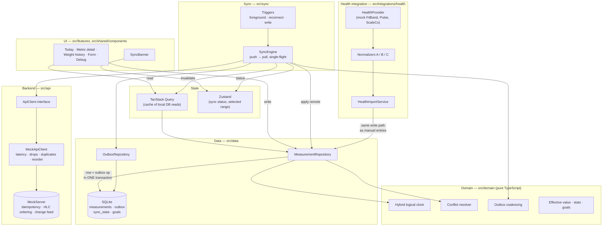
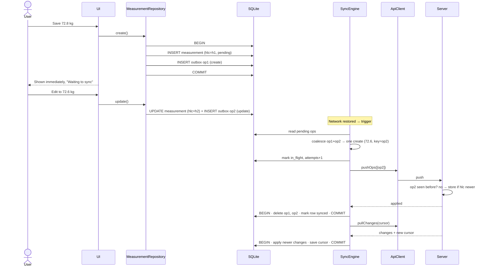
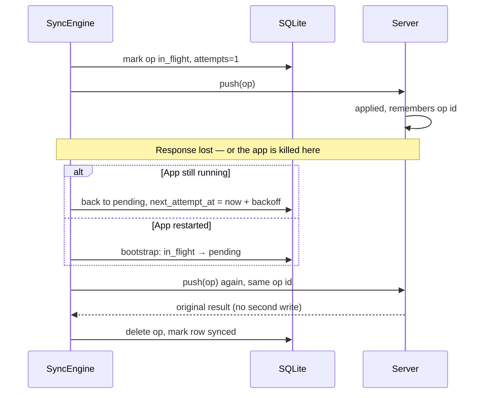

# Architecture

## Components and data flow

Rules the diagram encodes:

- The UI never talks to the network. It reads and writes the local database;
  the sync engine is the only thing that calls the API.
- A local write and its outbox entry are one transaction.
- Arrows into `Domain` are function calls into pure code with no I/O.
- `ApiClient` and `HealthProvider` are the two external boundaries. The mock
  implementations sit behind them and are chosen in one place each
  (`src/app/bootstrap.ts`, `src/integrations/health/registry.ts`).

## A write made offline, then synced

## Response lost, or app killed mid-request

